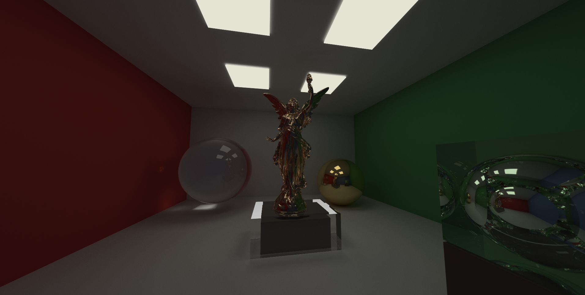

# Vulkan Gallery Renderer



## Overview

A sophisticated real-time ray tracing renderer built with Vulkan and RTX extensions, featuring an interactive art gallery scene that demonstrates advanced global illumination techniques.

## Key Features

- **Real-time Ray Tracing**: Hardware-accelerated using Vulkan RTX extensions (VK_KHR_ray_tracing_pipeline)
- **Cornell Box Lighting Model**: Classic computer graphics lighting demonstration with colored walls
- **Advanced Materials**: Dielectric, metallic, and lambertian surface materials with realistic light interaction
- **Interactive Camera**: Free-flying camera with depth of field and exposure controls
- **Performance Optimized**: Maintains interactive framerates on RTX-capable hardware
- **Asset Loading**: Support for OBJ model files and texture mapping

## Gallery Scene

The main scene showcases a modern art gallery environment featuring:

- **Color Bleeding Effects**: Colored walls demonstrate global illumination with realistic light bouncing
- **Material Variety**: Glass installations, bronze sculptures, and metallic art pieces
- **Strategic Lighting**: Area lights positioned for optimal visual demonstration
- **Lucy Sculpture**: High-detail 3D model with bronze material and glass enclosure
- **Cornell Box Design**: Optimized room dimensions for enhanced color bleeding visibility

## Technical Implementation

### Rendering Pipeline
- Vulkan-based ray tracing with hardware acceleration
- Accumulation buffer for noise reduction during static scenes
- Real-time material parameter adjustment via ImGui interface
- Multi-bounce path tracing with configurable depth limits

### Scene Architecture
- Hierarchical acceleration structures for optimal ray traversal
- Instance-based object management for memory efficiency
- Texture streaming and management system
- Camera system with interactive controls

## Build Requirements

- **Vulkan SDK** 1.2.162 or later
- **RTX-capable GPU** (RTX 20-series or newer, or equivalent)
- **Visual Studio 2019/2022** (Windows)
- **CMake** 3.15 or later
- **vcpkg** for dependency management

## Building

### Windows
```bash
# Install dependencies via vcpkg
vcpkg_windows.bat

# Build the project
build_windows.bat
```

### Linux
```bash
# Install dependencies via vcpkg
./vcpkg_linux.sh

# Build the project
./build_linux.sh
```

## Usage

Launch the executable and use the following controls:

- **WASD**: Move camera
- **Mouse**: Look around
- **Tab**: Toggle UI
- **Space**: Pause/resume accumulation
- **R**: Reset camera position

The UI allows real-time adjustment of:
- Ray tracing parameters (bounces, samples per pixel)
- Camera settings (field of view, aperture, focus distance)
- Material properties and lighting

## Performance

On RTX 2080 Ti hardware:
- **1080p**: ~200+ FPS at 4 samples per pixel, 8 bounces
- **1440p**: ~120+ FPS at 4 samples per pixel, 8 bounces
- **4K**: ~60+ FPS at 2 samples per pixel, 6 bounces

Performance scales with ray complexity and scene geometry density.

## Technical Highlights

- Efficient BVH acceleration structures for fast ray-scene intersection
- Importance sampling for realistic light transport
- Temporal accumulation for noise reduction
- Memory-optimized texture and geometry management
- Cross-platform Vulkan implementation

## Gallery

Interactive Gallery Scene demonstrating Cornell Box lighting effects, material variety, and realistic global illumination in a modern art gallery setting.

## License

See LICENSE file for details.

## Acknowledgments

Special thanks to the Vulkan and RTX developer communities for their excellent documentation and examples.
